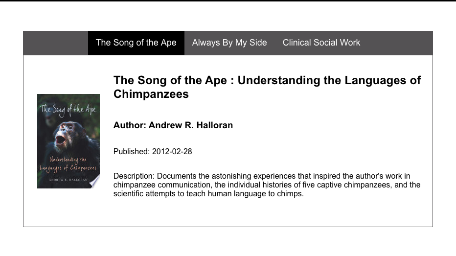

## React Tab Project
_______________

## Deployed Site
https://5fc640940da679450d3d08f2--confident-blackwell-9ecf19.netlify.app/

## Sample

## Description
________________

This front end application is built using the framework React. All css styling is done without the assistance of material ui or bootstap. The application pulls from the google books api to populate the tabs of information. Overall,
this project displays a tab component. Each tab is populated by an individual book and the user is able to click on each tab to display that individual books information. The title, author, published date, description, and picture are all pulled from the api. 

